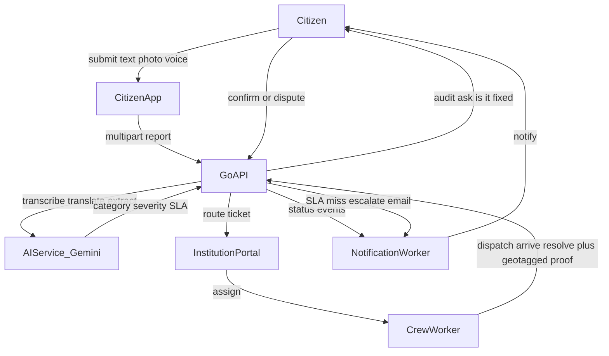
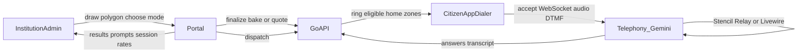
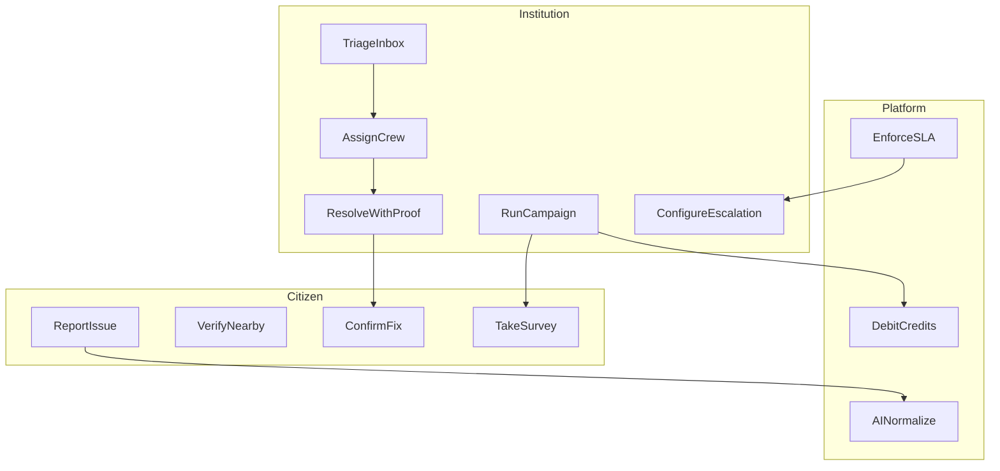
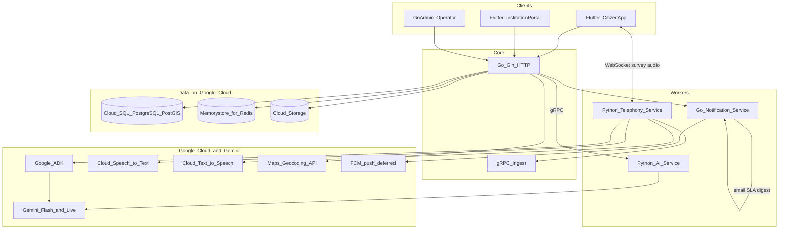

# CivicPulse AI — Product Document

## Brief about the solution

**CivicPulse AI** is a privacy-first civic engagement platform that connects citizens and municipal institutions around local infrastructure problems.

Citizens report issues with text, voice, or photos from a Flutter app—location is captured only when they act, never as background tracking. AI turns messy multilingual input into structured English tickets, routes them by department, and merges nearby duplicates on a community map.

Institutions work from a gated web portal: SLA-backed work orders, geo-tagged proof of resolution, citizen confirmation audits, escalation ladders, and geofenced **in-app voice surveys** (Stencil / Relay / Livewire) powered by Google Gemini—without PSTN carrier setup for the hackathon demo.

The product closes the loop that most complaint apps leave open: report → dispatch → prove the fix → ask the citizen if it is actually fixed → escalate when SLA slips.

---

## Opportunities

### a. How different is it from any of the other existing ideas?

| Typical civic / grievance tools | CivicPulse |
| --- | --- |
| Web forms or WhatsApp dumps into a spreadsheet | Structured tickets with AI categorization, severity, and department routing |
| One-way “submit and hope” | Live statuses, geo-tagged resolution proof, and a 24h citizen “is it fixed?” audit |
| Manual phone surveys or paper IVR | In-app dialer with three Google-backed modes (cached keypad, turn-based Gemini, live Gemini) |
| Self-serve institutional signup | Domain-verified B2G onboarding (no fake municipal accounts) |
| Always-on location for “engagement” | One-tap / submit-time GPS only; explicit Home Zone for survey eligibility |
| Single “admin” inbox | Admin + crew logins; workers only see tickets assigned to them |

Most existing ideas stop at **intake**. CivicPulse is built as an **accountability operating system** for municipalities: SLA clocks, escalation emails, equity/heatmap analytics, and outbound survey campaigns that land inside the same citizen app.

### b. How will it be able to solve the problem?

1. **Lower the cost of truthful reporting** — Multimodal, multilingual, offline-capable submission so more real issues enter the system.
2. **Reduce noise** — Spatial duplicate merge and community verify/upvote so desks see urgency, not clutter.
3. **Force honest closure** — Resolve requires a geo-tagged photo; the original reporter confirms later.
4. **Automate accountability** — Missed SLAs climb a configurable escalation ladder with AI-summarized failure context.
5. **Close the feedback gap** — Institutions run geofenced voice surveys (Stencil / Relay / Livewire) to the people who live in the affected polygon, using Gemini for conversational intelligence and Google Cloud speech for turn-based audio.

### c. USP of the proposed solution

**Accountability with proof, not just petitions**—paired with **Google Gemini–native survey modes** that run in-app (no carrier KYC for the demo), on top of a **privacy-first** location model and **domain-gated** municipal access.

---

## List of features offered by the solution

### Citizen app

- Phone OTP sign-in (hackathon: one-tap demo account)
- Mandatory Home Zone pin (survey eligibility); skip via seeded demo
- Multimodal grievance: text, photos, voice
- Offline queue and sync when connectivity returns
- Nearby community map, upvote/verify, context threads
- Ticket detail with status, SLA visibility, and public escalation designations
- Edit grievance while status is still open
- In-app mock dialer (accept / decline / DTMF) for surveys
- Survey hours window; available + incoming surveys; editable transcripts within the edit window
- Civic points / rewards UI
- EN / HI localization

### Institution portal

- Gated email/password login (hackathon: one-tap demo admin)
- Department inbox with status / overdue filters, SLA, severity, assignee
- Ticket detail: map pin, context, internal notes, crew assignment, flag-as-fake (admin)
- Work-order lifecycle: open → dispatched → arrived → resolve with proof photo
- Escalation ladder configuration (Accountability)
- Crew invite / assign / scoped inbox
- Survey campaigns: CSV seed, polygon dispatch, Stencil editor, Relay / Livewire scripts
- Quote, finalize, pause, archive; results with prompts and session rates
- Analytics / heatmaps / equity / digests (Premium; seeded for hackathon)
- Institutional leaderboard (public)

### Platform / AI

- Transcription, translation, entity extract, severity / department routing (Gemini)
- Photo anonymization (faces / plates)
- Cloud SQL (PostGIS) duplicate merge and geofenced campaign targeting
- Google Maps Geocoding for CSV addresses
- Google Cloud Speech-to-Text / Text-to-Speech on Relay turns
- Gemini Flash (Relay) and Gemini Live (Livewire) via Google ADK
- Credit wallet with mode-based burn and mid-call wallet-zero stop
- Encryption at rest for phone PII; account deletion for DPDP/GDPR-style flows

---

## Process flow diagram or Use-case diagram

### Primary grievance loop

### Survey campaign loop

### Actor use cases (summary)

---

## Architecture diagram of the proposed solution

**Repos (monorepo):**

| Repo | Role |
| --- | --- |
| `civicpulse-citizen-app` | Flutter citizen client |
| `civicpulse-institution-portal` | Flutter institution web |
| `civicpulse-server` | Go API, auth, tickets, campaigns, billing stubs |
| `civicpulse-ai-service` | Python Gemini agents (transcribe / extract / analyze / anonymize) |
| `civicpulse-telephony-service` | Python survey engines (Stencil / Relay / Livewire) |
| `civicpulse-notification-service` | Go FCM / email workers |
| `civicpulse-infra` | Compose, contracts, env, product plan |

---

## Technologies to be used in the solution

Emphasis on **Google** stack for this Google-organized hackathon:

| Layer | Technology | Google relevance |
| --- | --- | --- |
| Cross-platform UI | **Flutter** (mobile + web) | Google’s UI toolkit; single codebase for citizen app and institution portal |
| Conversational AI | **Gemini** (`gemini-*-flash`, Live API) | Report understanding, Relay turns, Livewire barge-in dialogue |
| Agent runtime | **Google ADK** (`Runner.run_async` / `run_live`) | Structured tool calling for survey progression |
| Speech | **Cloud Speech-to-Text** + **Cloud Text-to-Speech** | Relay STT/TTS pipeline |
| Maps | **Google Maps Geocoding API** | CSV address → lat/lng for campaign seeding |
| Push (designed) | **Firebase Cloud Messaging** | Status / audit notifications (wiring deferred where keys empty) |
| RPC contracts | **Protocol Buffers** + **gRPC** | AI and telephony ingest APIs |
| Auth / crypto | JWT, AES phone encryption | Platform security |
| API | Go (Gin), Python (FastAPI-style workers) | High-concurrency core + AI/telephony workers |
| Data | **Cloud SQL for PostgreSQL** with **PostGIS** | Managed civic database: duplicate merge, home-zone eligibility, campaign polygons |
| Cache / jobs | **Memorystore for Redis** | Rate limits, survey and notification queues |
| Media | **Cloud Storage** | Photos and baked Stencil audio |
| Ops UI | GoAdmin | Platform provisioning of institutions / domains |

The data plane runs entirely on Google Cloud: Cloud SQL holds tickets, institutions, and geography; Memorystore carries rate limits and worker queues; Cloud Storage holds report photos and survey audio. Flutter’s on-device queue covers offline reports. **Live payments are deferred for the hackathon** (UPI via Razorpay is a later add-on); demo institutions are seeded with Premium and survey credits.

---

## Additional Details / Future Development

- **Hackathon demo mode** (`HACKATHON_DEMO=true`): seeded citizen (`+919999000001`) and institution (`judges@civicpulse.demo` / `HackathonJudge1!`), one-tap login banners, Billing nav hidden, Premium unlocked without Razorpay.
- **Outbound PSTN / WhatsApp calling** for CSV contacts who never install the app (Exotel / MSG91-class providers)—deferred; mock dialer covers the demo path.
- **FCM push** for survey rings and status (today: HTTP poll for incoming surveys).
- **Prompt-to-script / Genkit-style IVR generation** for institutions (future; Stencil editor ships today).
- **Open data API**, contractor bidding marketplace, IoT ingest, grant-proposal assistant (roadmap ideas).
- **Live Razorpay UPI** checkout and credit packs when production keys are configured.

---

## Implementation cost

Region **Mumbai (`asia-south1`)**. Prices are public on-demand list rates, converted at **₹96.03 per USD** (rupee close, 28 Sep 2026). An Indian Cloud Billing account also pays **18% GST**. 730 hours is a full month. Re-check the [pricing calculator](https://cloud.google.com/products/calculator) before a procurement.

### 1,000 consumers a month

**About ₹16,000 per month**, GST included. That is about **₹16 per active citizen**.

Load assumed for those 1,000 monthly active citizens:

- About 200 new reports (one citizen in five files one). Each report is a few Gemini Flash calls for transcription, translation, extraction, and routing.
- About 100 survey sessions, mostly Stencil and Relay, plus about 10 Livewire calls of roughly 3 minutes.
- A few institution desks on the portal. The API and workers stay on all month, because survey and notification jobs wait on Redis.

| Resource | Size for this load | INR / month |
| --- | --- | ---: |
| Compute Engine | 1× `e2-medium` (2 shared vCPU, 4 GB), on 24×7 | 2,867 |
| Boot disk | 20 GB balanced | 230 |
| Internet egress | About 10 GB | 115 |
| Cloud SQL for PostgreSQL | Zonal, 1 vCPU, 3.75 GiB RAM, 20 GB SSD, PostGIS | 5,062 |
| Memorystore for Redis | Basic tier, 1 GiB | 3,435 |
| Cloud Storage | Photos and baked survey audio, about 10 GB plus a little egress | 288 |
| Gemini | Reports, Relay, and the short Livewire calls above | 1,440 |
| Maps Geocoding | Inside the $200 / month Maps credit | 0 |
| Speech-to-Text and Text-to-Speech | Relay audio, inside the free minute and character tiers | 0 |
| Firebase Hosting | Institution portal, inside the free tier | 0 |
| **Usage** | | **13,437** |
| GST 18% | | 2,419 |
| **Monthly cost** | | **₹15,856** |

Cloud SQL uses the published Enterprise on-demand rate (1 vCPU at $0.0413/hour, memory at $0.007/GiB-hour, SSD at about $0.17/GB-month). Memorystore Basic M1 is $0.049/GiB-hour. The instance is a single zone; a highly available pair is roughly double the database compute. Speech-to-Text above the free hour is about ₹1.50 per minute. One extra hour of Livewire audio is about ₹250–400.

### Hackathon demo, per month right now

**About ₹4,300 per month** while the demo VM stays on, GST included.

This is the bill for the deployment used in judging: one `e2-medium` in Mumbai, its boot disk, a small Gemini allowance, and the institution portal on Firebase Hosting. Maps and Speech stay inside their free credits at demo volume.

| Resource | Demo month | INR / month |
| --- | --- | ---: |
| Compute Engine | 1× `e2-medium`, on 24×7 | 2,868 |
| Persistent disk | 20 GB balanced | 230 |
| Internet egress | A few GB | 48 |
| Gemini | Reports, Relay, about 15 short Livewire calls | 480 |
| Maps, Speech, Firebase Hosting | Inside free tiers and the Maps credit | 0 |
| **Usage** | | **3,626** |
| GST 18% | | 653 |
| **Deducted** | | **₹4,300** |

A new billing account’s **$300 / 90-day credit** covers the demo for several months. The ₹4,300 figure is the amount after that credit is gone. Stopping the VM stops the compute charge; the disk and a reserved address still bill until they are deleted.

CivicPulse’s north star remains the same after the hackathon: **every civic claim ends in a verified outcome or an escalated explanation**—not an ignored ticket.
